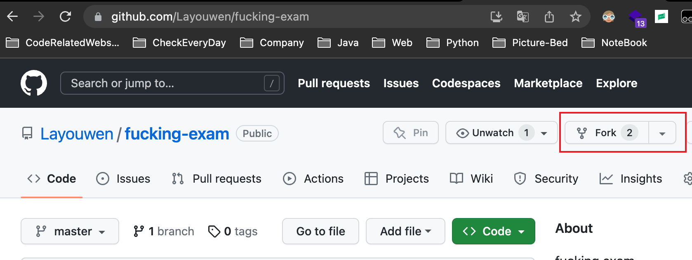
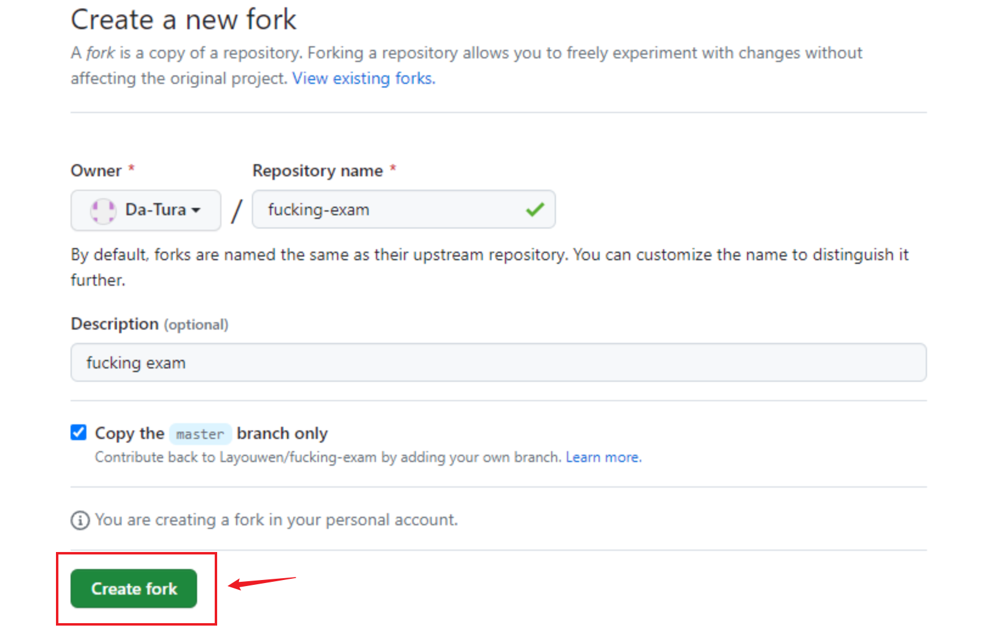
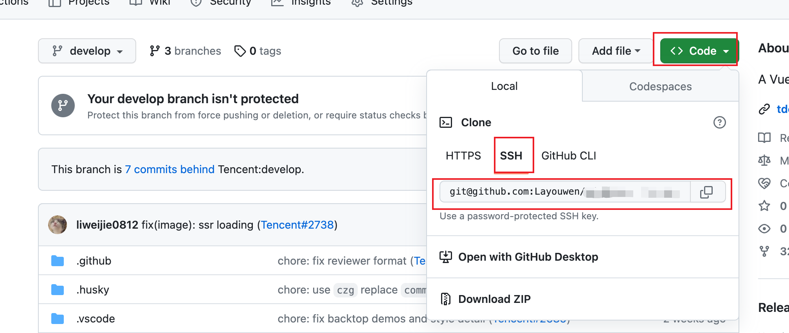

# Fucking Exam

English | [简体中文](./README-zh_CN.md)

## Introduction

Are you struggling with practicing exam questions?

Do you find yourself relying on muscle memory and remembering the position of answers instead of truly understanding the
material?

Is the fixed order of questions causing you to depend on memorizing answers in order instead of learning the concepts?

Well, this system can't help you cheat on exams, but it can help you practice with quality!

## Features

- 💡 TypeScript: a language for application-level JavaScript
- 📜 Exam Papers: categorize questions by exam papers and create your own custom exam papers
- 💎 Combination: combine questions from different exam papers to create new ones
- 📐 Question Randomization: randomize the order of questions
- 🚀 Option Randomization: randomize the order of answer options

## Contributing

1. open [https://github.com/Layouwen/fucking-exam](https://github.com/Layouwen/fucking-exam) page

2. click `Fork`



3. click `Create fork`



4. clone your fork repo



```bash
git clone $YourForkUrl
```

5. add upstream and update repo

```bash
git remote add upstream https://github.com/Layouwen/fucking-exam.git
git fetch upstream master
git merge upstream/master
```

6. init deps

```bash
pnpm ready
```

7. develop

```bash
cd packages/admin-frontend
pnpm dev
```
